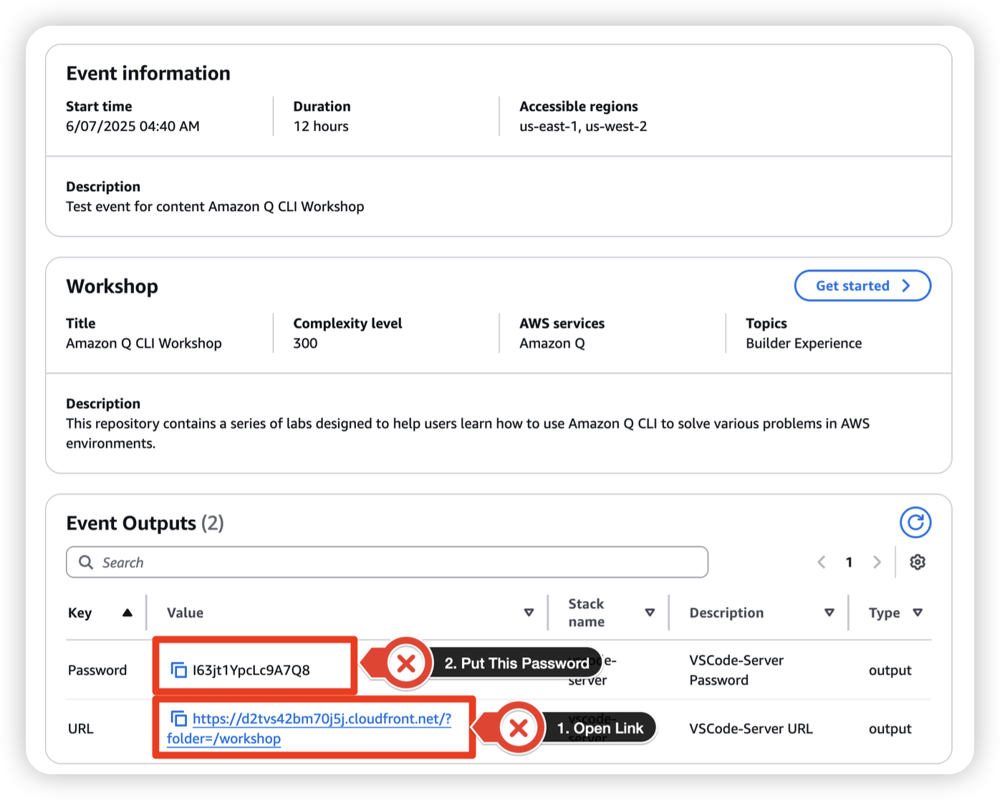
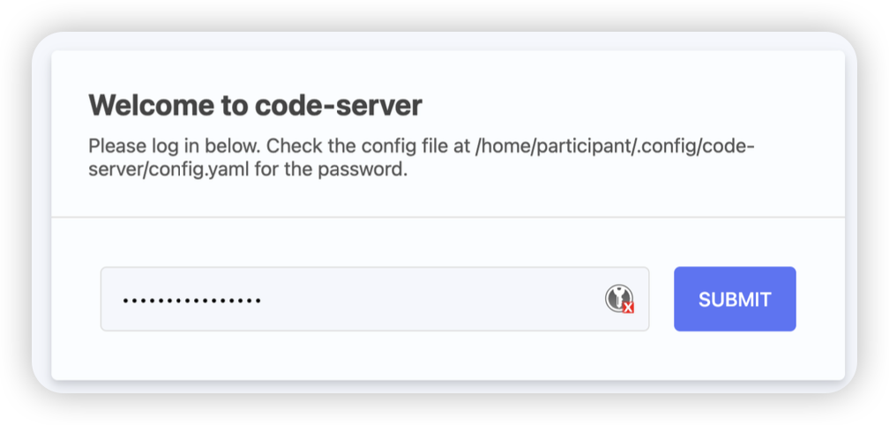
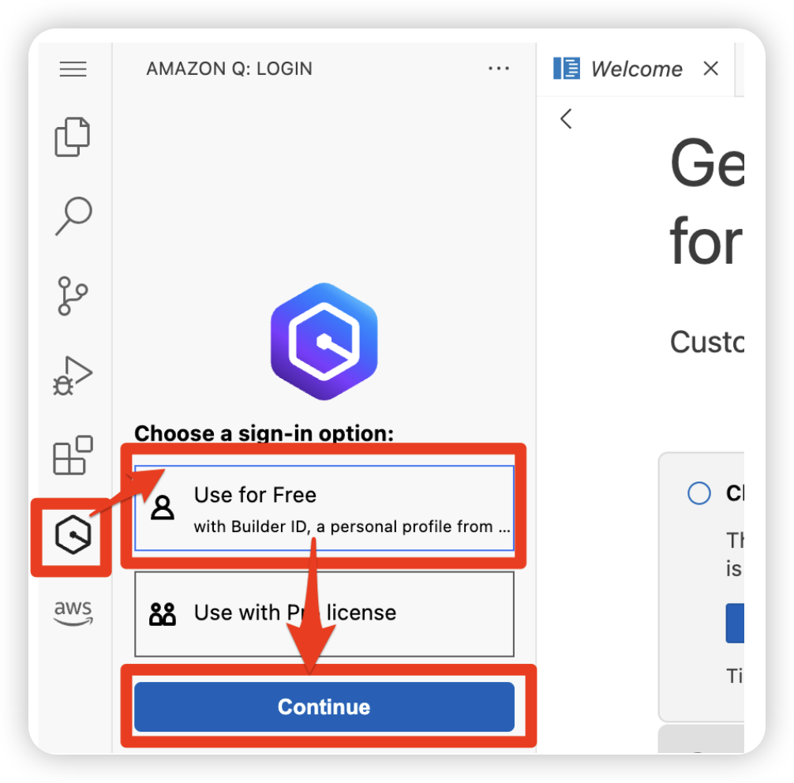
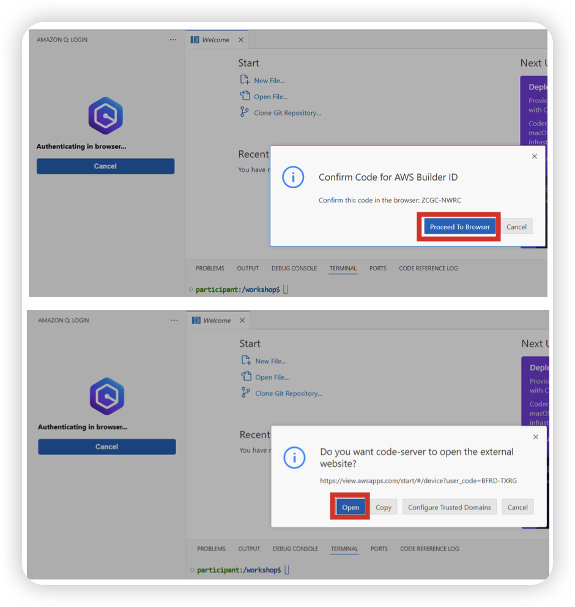
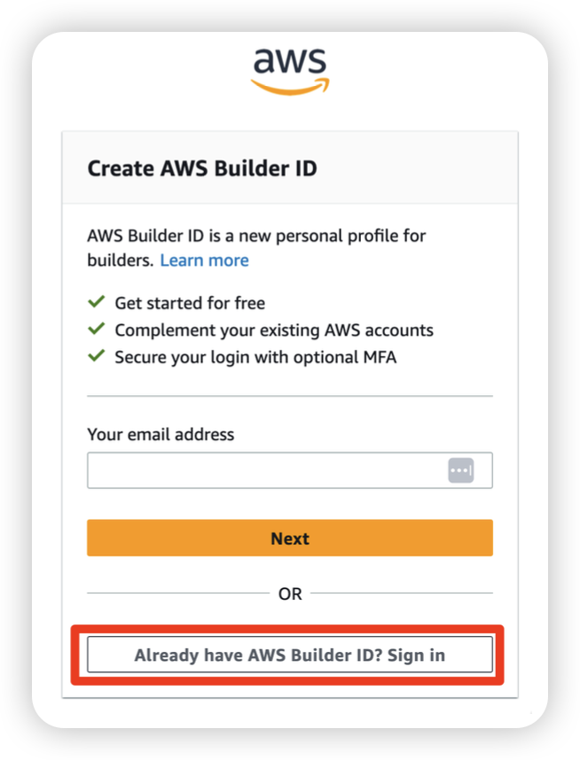
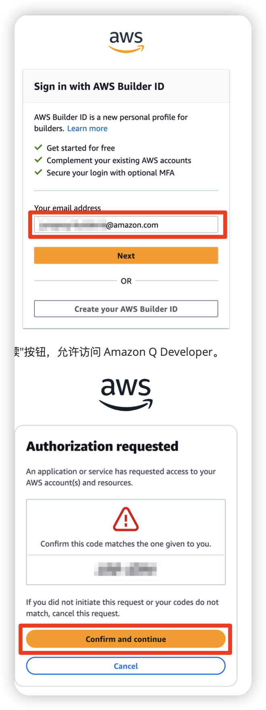
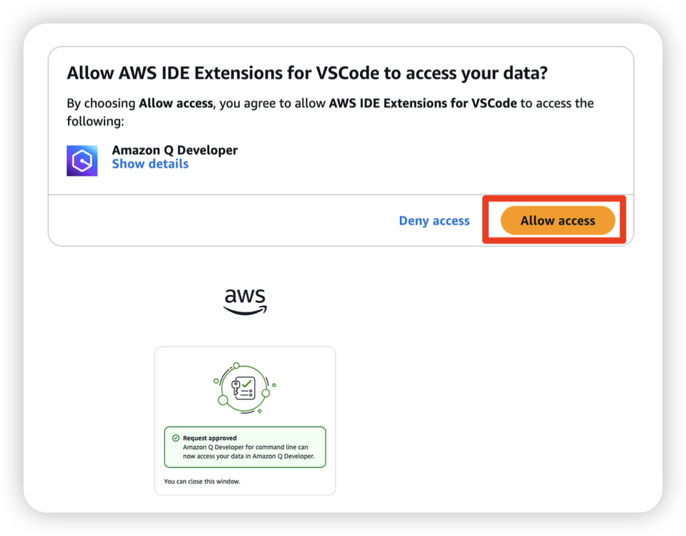
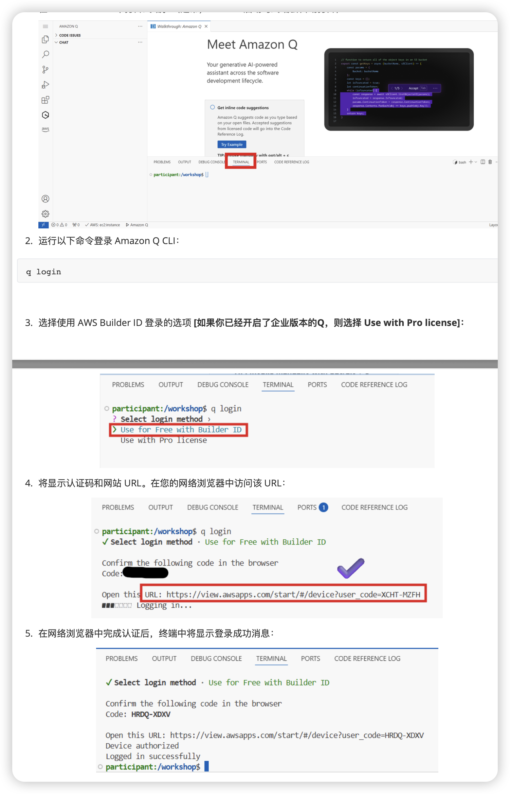
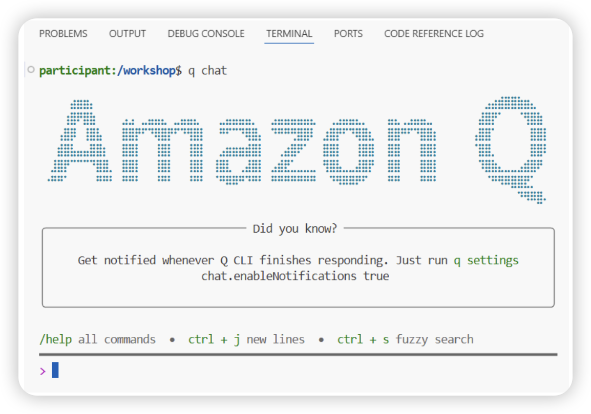

# Amazon Q CLI Workshop 邀请课程 - 专属实验教材1


您将通过一系列实验来学习和掌握 Amazon Q for command line 的各种功能和使用场景。

实验概览

1. **基础功能**：学习 Amazon Q for command line 的基本能力，包括聊天交互、文件操作和执行命令。
2. **代码开发**：探索 Amazon Q 如何帮助您更高效地编写、调试和优化代码。
3. **AWS 资源管理**：了解如何使用 Amazon Q 创建、配置、监控和排除 AWS 资源故障。
4. **高级功能**：掌握使用 Amazon Q 进行复杂任务自动化、多步骤问题解决和最佳实践建议。

每个实验都建立在前面学到的技能基础上，逐步引入更高级的概念和使用场景。通过完成所有实验，您将全面了解 Amazon Q for command line 如何提高您作为开发人员或云实践者的生产力。


# 0. 环境准备 - workshop工作坊环境设置

#### 访问 VSCode Server

在本次工作坊中，每位参与者都将获得一个在 EC2 实例上运行的 VSCode Server 环境。该环境已预先安装了 Amazon Q CLI 和 Amazon Q Developer 扩展程序。

1. 在工作坊网站的事件输出部分查看 VSCode Server 访问链接。

   

当 VSCode Server 登录页面打开时，输入事件输出中提供的密码进行登录。



#### 连接 Amazon Q Developer 扩展

当您访问 VSCode Server 时，Amazon Q Developer 扩展已经安装好了。现在，让我们使用 AWS Builder ID 连接 Amazon Q Developer。

1. 点击 VSCode 左侧边栏中的 Amazon Q Developer 图标。

   

点击登录按钮，将显示一个认证码，同时在您的网络浏览器中打开 AWS Builder ID 认证页面。



继续进行 AWS Builder ID 认证过程：

- **如果您没有 AWS Builder ID**：点击"创建 AWS Builder ID"按钮创建一个新账户。

  

**如果您已经有 AWS Builder ID**：使用您注册的电子邮件地址登录。



登录后，验证认证码并点击"确认并继续"按钮，允许访问 Amazon Q Developer。



#### 设置 Amazon Q CLI

Amazon Q CLI 允许您在终端中直接与 Amazon Q 对话。Amazon Q CLI 已经安装在您的 VSCode Server 环境中。

1. 在 VSCode Server 中打开终端。（通常，VSCode 启动时终端会自动打开）

   

2. 运行以下命令登录 Amazon Q CLI：

```bash
q login
```


3. 选择使用 AWS Builder ID 登录的选项 **[如果你已经开启了企业版本的Q，则选择 Use with Pro license]：**


4. 将显示认证码和网站 URL。在您的网络浏览器中访问该 URL：


5. 在网络浏览器中完成认证后，终端中将显示登录成功消息：


运行以下命令验证 Amazon Q CLI 是否正常工作：

```bash
q chat
```





## 1. Amazon Q for command line 基础功能

让我们从第一个实验开始，学习 Amazon Q for command line 的基本功能！本实验将帮助您熟悉Amazon Q for command line的基本功能和交互方式。

#### 实验目标

- 了解基本的`q chat`交互方式
- 探索Amazon Q的文件操作能力
- 学习如何使用Amazon Q执行Bash命令

#### 步骤1: 基本交互

启动Amazon Q chat会话：

```bash
q chat
```

尝试以下基本问题：

1. "你好，你能做什么？"
2. ~~"解释一下AWS Lambda是什么？"~~
3. "如何创建一个S3存储桶？"

使用`/quit`退出chat会话。

#### 步骤2: 文件操作

Amazon Q可以帮助您读取、创建和修改文件。启动一个新的chat会话，尝试以下操作：

```bash
q chat
```

尝试以下请求：

1. "创建一个名为hello.py的Python文件，打印'Hello, Amazon Q!'"
2. "读取hello.py文件的内容"
3. "修改hello.py，添加一个函数计算两个数字的和"

#### 步骤3: 执行Bash命令

Amazon Q可以执行Bash命令。在chat会话中尝试：

1. "列出当前目录下的所有文件"
2. "创建一个名为data的新目录"
3. "查看系统信息"

#### 步骤4: 探索AWS CLI集成

Amazon Q可以帮助您使用AWS CLI：

1. "如何使用AWS CLI列出我的S3存储桶？"
2. "如何查看我的EC2实例？"

#### 挑战任务

1. 使用Amazon Q 创建一个简单的Python脚本，该脚本可以读取一个文本文件并计算其中的单词数量
2. 使用Amazon Q 帮助您了解当前系统的网络配置

#### 总结

在本实验中，您学习了Amazon Q for command line的基本功能，包括交互式对话、文件操作、执行Bash命令以及AWS CLI集成。这些基础功能将在后续实验中进一步应用于更复杂的场景。


## 2. 使用Amazon Q进行快速网站开发与云端部署

本实验将展示如何使用Amazon Q Developer CLI来提高代码开发效率，包括代码编写、调试和优化。

#### 实验目标

- 使用Amazon Q生成代码 与 环境部署

  

#### 步骤: 创建酷炫前端网站示例

让我们尝试使用Amazon Q一句话生成一个酷炫的前端网站：

1. 创建一个新目录用于存放前端网站代码：

```bash
mkdir -p cool-website
cd cool-website
```

2. 启动Amazon Q chat会话并输入以下请求：

```bash
q chat --trust-all-tools
```


3. **在chat会话中输入：**

```
创建一个酷炫的响应式前端网站，包含导航栏、英雄区、特性展示和联系表单，使用现代CSS动画效果和深色主题，并添加一些交互元素
```

- Amazon Q将为您生成完整的HTML、CSS和JavaScript代码，创建一个现代化的响应式网站

- 在VS Code浏览器（或者下载到本地）中打开生成的HTML文件，查看效果

  

4. **让我们增加一些业务变更需求，在chat会话中输入：**

```
前端网站应该包含目前主流的大数据技术栈的介绍，请把大数据技术栈的元素融入当前网站中。
```

- 在VS Code浏览器（或者下载到本地）中打开生成的HTML文件，查看变更后的效果
- README.md 项目简介已经生成，用VS Code的预览可以查看


5. **确认无误后，我们进行一键云端部署这个网站，在chat会话中输入：**

```
按照AWS最佳实践的方式进行一键部署，部署完成后给我访问地址。提供AWS架构设计与部署方案，并完成测试与验证。记录整个过程并提供丰富的文档，规范化的文档，让我以后便于维护。
```

- 在VS Code浏览器（或者下载到本地）中打开生成的 Makrdown文档

- 查看目录下面的类似“DEPLOYMENT-SUMMARY.md”的部署总结

- 在/aws-deployment 目录下能够查看到 markdown格式的《AWS部署指南》，以及Q CLI自动生成的部署脚本


#### 挑战任务

1. 使用Amazon Q 继续更新业务需求，前端网站的内容继续变更，相关的文档也应该自动更新；
2. 使用Amazon Q 完成变更后的网站的一键部署与更新

#### 总结

在本实验中，您学习了如何使用Amazon Q Developer CLI来提高代码开发效率和一键部署到云端。

#### 参考资源

- [HTML基础 ](https://developer.mozilla.org/zh-CN/docs/Learn/HTML/Introduction_to_HTML)
- [JavaScript基础 ](https://developer.mozilla.org/zh-CN/docs/Learn/JavaScript/First_steps)
- [CSS基础 ](https://developer.mozilla.org/zh-CN/docs/Learn/CSS/First_steps)


## 3. 使用Amazon Q进行代码开发

本实验将展示如何使用Amazon Q Developer CLI来提高代码开发效率，包括代码编写、调试和优化。

#### 实验目标

- 使用Amazon Q生成代码  
- 利用Amazon Q调试和修复代码问题
- 通过Amazon Q优化现有代码
- 学习如何使用Amazon Q进行代码解释和文档生成


#### ~~步骤2.1: 代码生成~~

~~启动Amazon Q chat会话：~~

```bash
q chat
```

~~尝试以下代码生成请求：~~

1. ~~"创建一个Python函数，接受一个字符串列表并返回其中最长的字符串"~~

2. ~~"编写一个简单的Flask API，包含GET和POST端点"~~

3. ~~"生成一个AWS Lambda函数，处理S3事件通知"~~~~~~

4. ~~最后退出 Amazon Q chat会话：~~

   ```bash
   /quit
   ```


#### 步骤2.2: 代码调试

我们增加一些业务变更需求，使用Amazon Q来帮助调试：

```bash
q chat
```

尝试以下请求：

1. "查看 代码 文件"
2. "这个代码有什么问题？"
3. "帮我修复这些错误"

#### 步骤2.3: 代码优化

使用Amazon Q来优化现有代码：

1. "分析 代码 中的性能问题"
2. "如何优化这段代码？"
3. "重构这段代码以提高可读性和维护性"

#### 步骤2.4: 代码解释和文档

使用Amazon Q来理解和记录代码：

1. "解释 代码 中的主要功能"
2. "为这个应用程序生成API文档"
3. "添加适当的注释和类型提示"

#### 挑战任务

1. 使用Amazon Q创建一个简单的命令行工具，该工具可以从API获取数据并以表格形式显示
2. 使用Amazon Q帮助您理解并改进一个复杂的函数（自行上传一个代码文件，如complex_function.py）

#### 总结

在本实验中，您学习了如何使用Amazon Q Developer CLI来提高代码开发效率。您现在可以使用Amazon Q来生成代码、调试问题、优化性能以及创建文档，这些技能将帮助您在日常开发工作中节省时间并提高代码质量。


## 4. 使用Amazon Q管理AWS资源

本实验将展示如何使用Amazon Q Developer CLI来管理和优化AWS资源，包括资源创建、配置、监控和故障排除。

#### 实验目标

- 学习如何使用Amazon Q创建和配置AWS资源
- 探索使用Amazon Q进行AWS资源监控和优化
- 使用Amazon Q排除常见的AWS问题
- 了解如何使用Amazon Q实施AWS最佳实践


#### 步骤0: AWS资源 查询/排错/优化 的实战

启动Amazon Q chat会话：

```bash
q chat
```


**A、以下是一些您可以在Amazon Q CLI中使用的示例查询，以帮助您分析和理解《AWS网络架构》：**

（1）基本网络架构分析

```
请描述我当前AWS账户中的VPC架构，包括子网、路由表和安全组。
请分析 Default VPC 的VPC中的网络配置，并解释其设计原理。
我的VPC中有哪些子网？它们是如何配置的？
```

（2）网络连接性分析

```
请解释我的VPC中私有子网中的EC2实例如何访问互联网？
不同子网中的EC2实例之间如何通信？有什么限制吗？
我的VPC中的安全组配置是否存在安全风险？有什么改进建议？
```

（3）网络架构可视化

```
请帮我生成一个网络架构图，展示VPC中的子网、路由表、安全组和EC2实例之间的关系。
请用图表形式展示我的VPC中的流量路径，特别是从私有子网到互联网的路径。
```

（4）网络架构优化

```
请分析我当前的网络架构，并提供优化建议，特别是关于安全性和可用性方面。
我的VPC架构是否符合AWS最佳实践？有什么需要改进的地方？
如果我想实现高可用性，我的网络架构需要如何调整？
```

（5）故障排除

```
我的私有子网中的EC2实例无法访问互联网，可能的原因是什么？如何排查？
我的公有子网中的EC2实例无法通过SSH连接，请帮我分析可能的原因和解决方案。
我的VPC中的NAT网关似乎不工作，如何诊断和解决这个问题？
```

（6）成本优化

```
我的网络架构中有哪些组件可能导致不必要的成本？如何优化？
NAT网关的成本较高，有什么替代方案可以降低成本同时保持功能？
```

（7）安全增强

```
如何增强我的VPC安全性？有什么建议的最佳实践？
我应该如何实现VPC流日志来监控网络流量？
如何使用网络ACL和安全组来实现深度防御？
```


**B、以下是一些您可以在Amazon Q CLI中使用的示例查询，以帮助您分析和理解《Cloudtrail 日志分析》：**

本实验将指导您使用Amazon Q CLI 调用 AWS CLI 分析 Cloudwatch trail 日志，确认某一个 EC2 实例是由谁终止的。

使用Amazon Q CLI来定位 EC2 实例关闭的原因：

```bash
- "请分析下最近的 EC2实例 是被谁终止的？"
```


**C、以下是一些您可以在Amazon Q CLI中使用的示例查询，以帮助您分析和理解《AWS资源使用状况分析与成本优化》**

本实验将指导您如何使用Amazon Q CLI分析AWS资源使用情况，获取成本优化建议，并实施优化措施。

1）查询资源使用情况

使用Amazon Q CLI查询您的AWS资源使用情况：

```bash
- "查询我上个月的EC2实例使用情况"
- "分析我的S3存储使用趋势"
- "显示我账户中最昂贵的服务"
- "查看我的RDS实例利用率"
```

2）获取成本优化建议

继续与Amazon Q对话，获取成本优化建议：

```bash
- "有哪些EC2实例可以调整大小以节省成本？"
- "识别闲置或未充分利用的资源"
- "推荐可以使用Savings Plans或预留实例的资源"
- "分析我的EBS卷使用情况并提供优化建议"
```

3）实施优化措施

根据Amazon Q的建议，实施优化措施。例如：

```bash
- 调整EC2实例XXX 型号为 t3.micro
- 删除未使用的资源 EC2 名字为 XXX
- 设置S3桶 XXX 的生命周期策略为XX
```

4）评估优化效果

实施优化措施后，使用Amazon Q CLI评估优化效果：

```bash
- "比较优化前后的成本差异"
- "预测下个月的AWS账单"
- "分析优化措施的影响"
```


**D、更多 资源使用分析查询 和  成本优化建议查询**

EC2实例分析


```bash
- "分析我的EC2实例使用情况，找出CPU利用率低于20%的实例"
- "查找过去30天内网络流量最低的EC2实例"
- "识别哪些EC2实例可以从按需转为Savings Plans或预留实例"
- "显示我的EC2实例按实例类型的分布情况"
```
存储分析


```bash
- "分析我的S3存储使用趋势，并预测未来3个月的增长"
- "找出未访问超过90天的S3对象"
- "识别可以转移到低成本存储类别的S3数据"
- "分析我的EBS卷使用情况，找出未附加或利用率低的卷"
```
数据库分析


```bash
- "分析我的RDS实例CPU和内存使用情况"
- "找出连接数较低的RDS实例"
- "识别可以调整大小的DynamoDB表"
- "分析我的Aurora集群的性能与成本比"
```

实例优化
```bash
- "推荐哪些EC2实例可以降级以节省成本"
- "分析使用Graviton处理器替换现有实例的成本影响"
- "建议哪些工作负载适合使用Spot实例"
- "计算将按需实例转换为Savings Plans的潜在节约"
```
存储优化
```bash
- "建议如何优化我的S3存储成本"
- "分析实施S3生命周期策略的潜在节约"
- "推荐哪些EBS卷可以转换为gp3类型以节省成本"
- "建议如何优化我的EBS快照策略"
```
网络优化
```bash
- "分析我的数据传输成本并提供优化建议"
- "建议如何减少NAT网关成本"
- "评估使用VPC端点的成本效益"
- "分析我的CloudFront使用情况并提供优化建议"
```
综合分析查询
```bash
- "分析我上个月的AWS账单，找出最大的成本驱动因素"
- "比较过去3个月的成本趋势并预测下个月的账单"
- "识别我账户中增长最快的服务成本"
- "建议一个全面的成本优化计划，按潜在节约排序"
- "分析我的标签策略并建议如何改进成本分配"
```
自动化查询
```bash
- "帮我创建一个脚本，自动识别并停止非工作时间的开发环境"
- "设计一个解决方案，自动调整资源大小以匹配实际使用情况"
- "帮我创建一个AWS Lambda函数，定期清理未使用的资源"
- "设计一个使用AWS Budgets的成本控制策略"
```


总结：通过本实验，您学习了如何使用Amazon Q CLI分析AWS资源使用情况，获取成本优化建议，并实施优化措施。这些技能可以帮助您持续优化AWS环境，降低成本，提高资源利用率。


#### 挑战任务

1. 使用Amazon Q为三层Web应用程序创建完整的基础设施即代码(IaC)解决方案
2. 请Amazon Q帮助您为关键应用程序设计灾难恢复策略

#### 总结

在本实验中，您学习了如何使用Amazon Q Developer CLI来管理和优化AWS资源。您现在可以利用Amazon Q创建和配置资源、监控和优化AWS环境、排除问题并实施最佳实践，使您的云操作更加高效。


## 4. Amazon Q高级功能

本实验将探索Amazon Q Developer CLI的高级功能，包括复杂任务自动化、多步骤问题解决和最佳实践建议。

#### 实验目标

- 掌握使用Amazon Q进行复杂任务自动化
- 学习如何高效解决多步骤问题
- 探索高级AWS基础设施管理
- 了解如何利用Amazon Q获取最佳实践建议

#### 步骤1: 复杂任务自动化

启动Amazon Q chat会话：

```bash
q chat
```

尝试以下复杂自动化任务：

1. ~~"创建一个Python脚本，监控目录中的新文件，使用AWS Lambda处理它们，并将结果存储在S3中"~~
2. "帮我使用GitHub Actions为Node.js应用程序设置CI/CD管道"
3. "生成一个自动备份所有EC2实例的脚本"
4. "创建一个监控解决方案，当我的AWS资源超过特定阈值时提醒我"

#### 步骤2: 多步骤问题解决

使用Amazon Q解决复杂的多步骤问题：

1. "我需要将单体应用程序迁移到微服务。帮我规划和执行这个过程"
2. "设计一个处理实时分析的无服务器数据处理管道"
3. "帮我为应用程序实施蓝绿部署策略"
4. "我需要优化数据库性能。指导我完成这个过程"

#### 步骤3: 高级AWS基础设施管理

使用Amazon Q探索高级AWS基础设施管理：

1. "为关键应用程序设计多区域、高可用性架构"
2. "帮我在AWS环境中实施零信任安全模型"
3. "为我的AWS资源创建成本优化策略"
4. "设计一个可以处理不可预测流量峰值的可扩展架构"

#### 步骤4: 最佳实践建议

学习如何从Amazon Q获取最佳实践建议：

1. "在AWS中保护容器化应用程序的最佳实践是什么？"
2. "我应该如何为微服务架构构建代码仓库？"
3. "分布式系统中错误处理的推荐模式是什么？"
4. "在应用程序中实施可观察性的最佳实践是什么？"

#### 挑战任务

1. 使用Amazon Q为多层应用程序创建全面的灾难恢复计划
2. 请Amazon Q帮助您为开发团队设计和实施完整的DevOps工作流程

#### 总结

在本实验中，您探索了Amazon Q Developer CLI的高级功能。您学习了如何自动化复杂任务、解决多步骤问题、管理高级AWS基础设施以及实施最佳实践。这些高级功能将帮助您在开发和运营工作中应对更复杂的挑战。


# 5.生成式 AI 加速软件开发 & 最佳实践提示词

生成式 AI 在软件开发生命周期 (SDLC) 中的好处

生成式 AI 的快速发展为改变软件开发生命周期提供了令人兴奋的机会。开发人员开始利用生成式 AI 的创造潜力来自动化重复性编码任务、生成测试用例、修复错误、优化代码、总结和解释代码，以及加速 SDLC 的许多其他部分。通过将生成式 AI 功能集成到他们的工具链中，工程团队可以提高生产力，降低成本，并更快地将新创新推向市场。

总体而言，Amazon Q 旨在提供一个 AI 助手，以支持开发人员和构建者在开发过程的每个阶段 - 从研究到部署再到升级。与现有开发者工具的集成有助于加速开发工作流程。


## 1）创建有效的提示

在不同工具（如 Amazon Q Developer，包括 IDE 中的 Q 聊天和 AWS 控制台中的 Q 聊天）中编写提示，由于它们不同的界面和功能，提供了不同的体验。每个工具都针对开发过程和用户偏好的不同方面，使得在每种情况下编写提示的体验都是独特的。

**IDE 内联补全的提示：** 在这里，开发人员可以插入内联提示以利用代码自动补全。Amazon Q Developer 的内联代码补全使用上下文和注释来理解预期的功能或特性，生成相应的代码。这种方法特别适合快速创建标准代码、复杂算法或创建单元测试。

**命令行的提示：** 扩展到命令行，命令行的 Amazon Q 允许开发人员通过终端命令使用其功能。这种设置非常适合那些喜欢或需要在命令行环境中工作的人，并提供自然语言到 bash 的转换。命令行工具还协助 500 多个 CLI 的自动编译。

**聊天中的提示：** Q 的 IDE 聊天功能为编码辅助提供了一个对话界面，允许开发人员以聊天式格式提出问题、生成代码和翻译代码。这种方法非常适合澄清编程概念、解决错误和解释代码。Q 作为一个虚拟编码助手，提供更多互动和引人入胜的指导和建议。

**AWS 控制台中的提示：** 在 AWS 控制台中，Q 通过聊天界面运行。这种模式特别适合云资源管理和故障排除或一般 AWS 服务问题。

在这些工具中编写和交互提示的方式可能会有显著差异。让我们深入了解制定优秀提示的一些最佳实践。

**具体和清晰：** 以具体和清晰的方式编写提示以获得所需的响应是至关重要的。提示应该直接说明任务并提供尽可能多的细节。

- **清晰度：** 涉及提示的准确性和具体性。清晰的提示几乎不会留下误解的空间，引导 Q 生成所需的特定类型的响应或操作。缺乏清晰度可能会导致不相关或偏离目标的响应。清晰的提示在像 Amazon Q Developer 这样的内联代码补全工具中特别重要，因为需要精确的编码解决方案。
- **意图：** 指提示背后的目的或目标。理解用户的意图使 Q 能够生成准确且与您的目标相关的响应。例如，如果意图是生成一个解决特定问题的代码块，提示应该清楚地反映这个目标。
- **上下文：** 涉及与提示相关的周围信息或环境。这包括文件中代码的状态等因素，可能是一个新文件，或者包含现有代码的文件，这些因素会影响 Amazon Q 如何处理内联补全。同样，在同一聊天会话中与 Q 的过去交互也可以影响其响应。上下文允许 Q 提供更符合用户当前需求的定制响应。例如，Q 对代码片段的响应受到现有代码的影响，而在 Q 的聊天界面中，对话历史是一个关键的上下文元素。

**使用示例：** 通过包含相关示例来增强您的提示，因为这种策略通过提供额外的上下文来指导 Q 产生更好的输出。考虑在新文件与包含代码的文件中提示可能被处理的不同方式，以及这种上下文如何提高建议的质量。这种区别很重要，可以通过保持相关的打开文件或在当前文件中添加内联来应用。

**迭代方法：** 不要犹豫根据响应来改进和重新表述您的提示。这种迭代方法是实现您期望结果的关键。这个过程的难易程度取决于使用的工具：例如，在 Q 聊天窗口中，迭代很简单，因为您可以在聊天对话中轻松询问。然而，Amazon Q 的内联补全需要您返回并直接编辑原始提示/注释或代码。

**分解复杂查询：** 对于复杂查询，将提示分解成更小、更易管理的部分可能是有效的。这种方法有助于逐步引导 Q 达到所需的输出。

**非确定性本质：** 生成式 AI 工具本质上是非确定性的。这意味着像 Amazon Q 这样的工具提供的响应或建议每次提出查询时都可能不同，即使提示和上下文保持不变。因此，这些工具的输出不是固定的而是动态的，反映了它们训练的最新状态和提示的当前上下文。此外，随着这些模型随时间更新和改进，响应的性质可能会改变。您应该为这种流动性做好准备，并理解这些建议是指导而不是确定的答案。这种非确定性质既是一种优势，提供了一系列可能性和新的视角，也是一个挑战，需要对每个响应进行批判性评估和上下文考虑。

现在我们已经探讨了创建有效提示的关键原则，让我们将这些概念付诸实践。

**Amazon Q**

- **推荐的提示（示例 1）：** "解释如何基于 CPU 利用率为 EC2 实例组实现自动扩展。"
- **为什么？** 这个提示很具体，请求特定任务（基于 CPU 利用率的自动扩展）的详细说明。
- **要避免的提示（示例 1）：** "我如何使用 EC2？"
- **避免的原因：** 这个提示过于宽泛，没有指定您需要哪方面的 EC2 信息。
- **总之**，Amazon Q Developer 的有效提示应该清晰、简洁和具体，详细说明所需的确切任务或信息。模糊的提示将缺乏清晰度并得到不充分的响应，导致挫折感。

**内联补全**

- **推荐的提示（示例 2）：** "创建一个 JavaScript 函数，按升序对数字数组进行排序。"
- **为什么？** 这个提示具体说明了编程语言（JavaScript）、任务（排序数组）和标准（升序）。
- **要避免的提示（示例 2）：** "我需要数组方面的帮助。"
- **避免的原因：** 这个提示缺乏具体性。需要对数组进行什么操作，或需要什么性质的帮助？


## 2）调整期望和最佳实践

随着我们更深入地使用生成式 AI，将我们的期望与这些工具的实际能力保持一致是至关重要的。生成式 AI 已经取得了重大进展，提供创新解决方案并自动化复杂任务。然而，认识到其局限性同样重要。

让我们深入了解生成式 AI 能够实现什么以及可能存在的不足之处的平衡视角。

生成式 AI 的能力

- **复杂问题解决：** 生成式 AI 擅长解决复杂问题、生成解决方案和代码翻译。
- **内容生成：** 它可以创建代码，回答紧迫问题的相关答案，解决问题，并使用在公司信息库、代码和企业系统中找到的数据和专业知识采取行动。
- **语言理解和交互：** 生成式 AI 表现出对自然语言的强烈理解，使其能够进行有意义的对话，回答问题并提供解释。

生成式 AI 的局限性

**依赖训练数据：** 输出质量在很大程度上取决于训练数据的质量和广度。Amazon Q 是一种由基础模型 (FM) 驱动的生成式 AI 服务，该模型在各种数据源上进行训练，包括 Amazon 和开源代码。此外，您还可以通过 IDE 中的 Amazon Q Developer 扩展或插件访问 Amazon Q。Amazon Q 建立在 Amazon Bedrock 上，这是一个完全托管的服务，用于构建生成式 AI 应用程序，提供来自 Amazon 和领先 AI 公司的高性能 FM 选择。Amazon Q 使用多个 FM 来完成其任务，并使用逻辑将任务路由到最适合该工作的 FM。

**Amazon Q 代码补全支持的编码语言：** 在 Amazon Q 的内联代码补全功能的上下文中，支持的编程语言范围存在限制。这意味着该服务可能不会自动支持您选择的语言。有关当前支持的语言和 IDE 的列表，您可以参考 Amazon Q Developer 用户指南中的 [Amazon Q Developer 中的语言支持 ](https://docs.aws.amazon.com/amazonq/latest/qdeveloper-ug/q-language-ide-support.html)。

**准确性和事实检查：** 一般来说，生成式 AI 有时可能会产生看似合理但事实上不正确的信息，在关键应用中需要人工验证。

通过认识到生成式 AI 的优势和劣势，用户可以更好地利用其能力，同时减轻其局限性。这种平衡的方法确保期望与现实保持一致，从而更有效和负责任地使用这种变革性技术。

## 3）AI 的负责任使用

**Amazon Q 有多安全？**

Amazon Q 的构建注重安全和隐私，它可以理解并尊重您现有的治理身份、角色和权限。它还可以使用这些信息来个性化其交互。如果用户没有权限在没有 Amazon Q 的情况下访问某些数据，他们也不能使用 Amazon Q 访问这些数据。Amazon Q 从一开始就被设计为满足严格的企业要求。

**Amazon Q 是否使用我的内容来训练任何模型？** 我们不会使用 Amazon Q Developer Pro 或 Amazon Q Business 的内容来改进服务。

**谁拥有 Amazon Q 生成的代码？**

就像使用 IDE 一样，开发人员拥有他们编写的代码，包括 Amazon Q Developer 提供的任何代码建议。开发人员对他们的代码负责，包括他们接受的 Q 建议。开发人员应该始终在接受代码建议之前审查它们，并可能需要进行编辑以确保代码完全按照预期工作。

**我可以防止 Amazon Q 内联代码补全推荐带有代码引用的代码吗？**

是的。Amazon Q 的引用跟踪器会检测代码建议是否可能与特定的 Amazon Q 开源训练数据相似。引用跟踪器可以用存储库 URL 和项目许可信息标记此类建议，或者选择性地过滤它们。

在 Amazon Q Developer 的配置设置中，您可以取消选择 **包含带有代码引用的建议** 选项。这将防止 Amazon Q 提出包含对已知许可的开源代码的引用的建议。

**Amazon Q Developer 会推荐带有安全漏洞的代码吗？**

Amazon Q Developer 的设计旨在防止建议带有安全漏洞的代码，并尽可能过滤掉许多安全漏洞。然而，考虑到 Amazon Q 的生成性质，我们不能完全排除带有安全问题的代码建议。因此，Q 带有内置的代码扫描功能，可以检测您的 Python、Java、JavaScript、C#、TypeScript、Ruby 和 Go 项目中的安全漏洞，包括来自 Amazon Q Developer 的代码建议和您编写的代码。

**Amazon Q Developer 会产生有毒或有偏见的代码吗？** Amazon Q 会过滤掉包含有毒短语的代码建议和包含常见已知表明偏见的代码结构的建议。


# 结束
